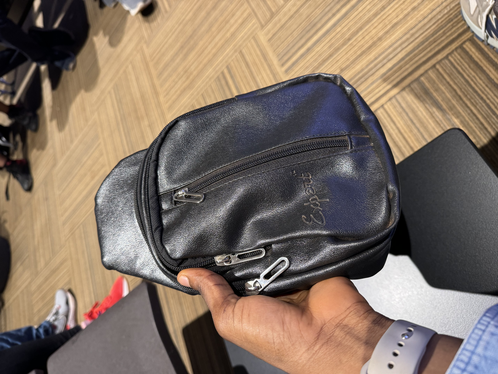

It’s not particularly an enjoyable Saturday afternoon. My flight from Goa to Delhi departs at 9:35 p.m., and the current time is 2:36 p.m. Unfortunately, I cannot relax at any of the fancy executive lounges at Mopa Airport until I have my boarding pass—which also doesn’t open until at least 3 hours before departure time. That gives me 7 hours to _“waste,”_ but what better waste of time than to document the most profound realizations I had on my trip to Goa?

Mumbai was the port of entry. After doing customs, I was welcomed by the usual airport tradition, where workers spot foreigners and offer a not-so-much-needed service for a fee—ethical extortion, I call it. But that was expected.

Everything went well until I had to catch the last flight to my final destination — Vagator, Goa. Finding my way around Mumbai Airport for my domestic flight with Spicejet had some friction, but that was pretty much expected, too.

At the check-in counter, the attendant pitched to me about paying an additional $20 to _“upgrade my flight”_ and get some food and Wi-Fi access. With my phone out of service and starving from a 16-hour journey from Accra to Dubai and Mumbai, who wouldn’t want some food and wifi? I “upgraded” without hesitation!

Unfortunately, the only good things about Spicejet were the pretty cabin crew and our safe landing. Nothing else was commendable about the entire journey. Barring the fact that the flight was delayed for more than an hour, food wasn’t served—not even a bottle of water. And the Wi-Fi I was promised, too, surprisingly decided not to work.

Not understanding the local language, having a phone with no internet access and not carrying cash is a sure way to get fucked. My second transaction involved using my card to get about 4000 INR($50) cash. Cash is king.

I appreciate how the guys at the money exchange went the extra mile to convey the `“You’re a foreigner, but we will not take advantage of you”` message without having to explicitly say that. They were patient and slow to reproach, ensuring I understood everything before signing the transaction. Their candor was impressive.

Now, unto the first cultural shift I experienced in India — all steering wheels are on the right-hand side.

When my cab arrived, the driver opened the door on the right, and my immediate reaction was to try to get in. Not knowing he was not opening for me but for him. We both burst into laughter as he perfectly understood what had happened. He shared that he encounters that with foreigners a lot; most of the world drives on the left. Every car I saw uses a manual transmission.

I hadn’t seen an automatic transmission vehicle in 14 days here, and the most common brand was the Suzuki. There is a culture of every cab driver wearing all white, which is the legal dress code. Interesting initiative.

Being a passenger here is incredibly anxious.

There’s a constant feeling of every turn reeking of a potential crash or accident. You will see the narrowest roads that can barely fit one sedan, accommodating two SUVs and some motorbikes.

And you’d imagine the driving style is defensive, but it’s not. It’s pure chaos and offensive. The roads are hard to navigate, and deep within me, I wish I had learned to drive in India. The rationale is that `if you can drive in India, you can drive anywhere`.

If they went for it, India could probably dominate F1 and racing sports where split-second decisions are ultimate deciders. Driving is challenging here.

I have seen just 1 or 2 women riding motorbikes in my entire life in Ghana. The gender ratio is not necessarily proportional in India, but I saw dozens of women riding motorbikes daily. Also, it appeared more of a flex and romantic to pick up a woman with a motorbike than with a car. The thrill, the arm wrapping, the subtle whispers she makes in your ears while you handle the wheel. Understandably so.

In a conversation with a friend, he asked me — `“have you been racially abused so far? I heard Indians are racists”`. But one of the best things here was the quality of service and the warm reception. I got many stares, but nothing abusive. I mean, `“What could a black and jacked, short-haired young man be doing in India in April?”`.

One security personnel at the airport attempted to intimidate me by passing me through rigorous security checks. It was a bit extreme, but it was nowhere near _“abusive.”_ He touched my hair — probably out of curiosity to feel the texture. That was it.

One of the best perks of being a foreigner is that your presence exudes competence. The idea of leaving your comfort zone, getting a visa, booking a ticket, and traveling to a new country several miles away from home screams, `“Wow, he is good.”`

## Service is 9/10

Along the shores of Baga Beach, I will never forget Sunita’s face and smile.

I walked up to her souvenir shop, gave some greetings, and introduced myself after confirming that she spoke English. She immediately introduced herself, stretched her arms, and gave me a firm handshake. After a short negotiation, she sold the bodybag to me for 500 INR.

However, a local would buy it for much cheaper. My point is that there is an unmatched level of earnestness. People mean business here.

I got to try the **Zomata** app for the first time. For context, Zomata is a restaurant aggregator and food-delivery app. The quality, intuitive UX, delivery speed, and everything else were the best I’ve ever experienced.

But Zomato wasn’t close as impressive as its counterpart, **Blinkit**. With Blinkit, you can order some high-quality stuff you need in your everyday life, ranging from gum, groceries, fresh fruits and vegetables, biotin, first aid kit, painkillers, condoms to electronics like adapters, HDMIs, karaoke kit, mouse, you name it, and receive it in less than 10 minutes. Yes, it’s not a joke.

I did some investigating into how they make this possible. For every 1-3km, Blinkit has at least one warehouse. As soon as you place your order, the nearest warehouse picks it up and delivers it to you as soon as possible. It works, and it’s crazy.

## The Casino Experience

The night before my birthday, the boys decided to go to a casino. We drove to Deltin, a riverboat floating casino.

The boat transport to the casino on the water was incredibly excellent. I felt pretty expensive that day. Funny enough, I remembered several episodes in The Blacklist where isolated _“on-water”_ events which have guests being transported by boat always go sideways. I cracked some jokes to ease the tension.

Deltin had about five levels. We spent our first few hours at the last level, a bar, where we enjoyed great Indian performances and unlimited food.

We went down a few levels and experienced the casino, where people were making and losing money. I didn’t understand any of the games, so I have less to say about the casino experience, but I saw someone lose about $8,000 that night and left with a wide smile.

When the clock struck, it was 12 a.m., and I was a year older. We hung around at the casino for a bit, had some more food, took some really cool pictures, and onboarded the next boat back.

It was a surreal experience. Rocking my native Ghanaian Kaftan and Topanga shoes, I looked like the obvious outlier, and everyone was super friendly to me.

## The Birthday

On the night of my birthday, we were at Thalassa, a beach restaurant with a great view. I didn’t particularly enjoy the food, but that night was the highlight and undoubtedly the best moment in Goa.

Some minutes after the birthday pleasantries, two local ladies approached me, complimented me, and asked me to dance with them. Well, for context, a local confirmed that it is rare for Indian women to make the first move like that. That sounds like I’ve been doing something right, right? :)

## Hats off to India

One of my favorite realizations about the country is the culture of showing reference and taking excellent care of older people. You see instances of this everywhere.

Western media has a way of spreading propaganda or trying to downgrade cultures that do not fit their ideologies. India is way better than you see in the media, and “way better” is an understatement.

India is far from perfect but excels in many ways. I saw the most impressive payment infrastructure, top-notch services at every corner, the fastest delivery, beautiful culture, and women, good internet speed(average. 150 MB/sec), and quality food.

It’s 4:47 p.m., and I’m wrapping it up. I have less than five hours left before my flight. Let me find a way to waste that time, too. See you soon, India!
