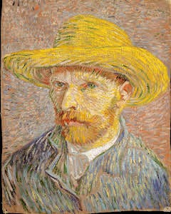
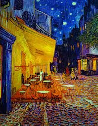
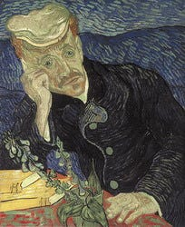
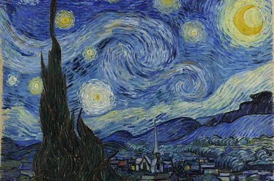

One of the saddest stories I’ve read about a genius is that of Vincent Van Gogh.

Van Gogh discovered his purpose in his late 20s — he hadn’t picked up a pencil until he has 27. Like any motivated young person will do, he purposely moved to Paris to study painting and it was during the last 2 years of his life that he created his best works.

For his relatively short career spanning just a decade, it is impressive that he did more than 2100 paintings with 9 making it into the top 200 most expensive paintings of all time.

If you don’t know the story, this is where you say to yourself — _“What a rich painter Van Gogh was!”_. Sorry to disappoint, but he lived off his younger brother for much of his adult life.

Van Gogh’s life is the antithesis of what you’ll consider a **“life well lived”** in this connected world.

Although a specific diagnosis of his condition is difficult to make with certainty due to the limited information available, psychologists believe that he suffered from a combination of mental illnesses that led to cutting his own ear off. Van Gogh, despite all his talent, sold only one painting and shot himself in the chest 4 months later. He died by suicide and did so broke at age 37.

For someone to have 2100 paintings to his name in 10 years (averaging 4 paintings per week), a little argument can be made to question his dedication and work ethic.

## What happened?

Van Gogh paid the price for being different. While the current market greatly rewards individuals with the uncanny ability to be eccentric (Elon Musk for example), the world Van Gogh grew up in didn’t.

His style of painting was not popular in the late 19th century. His use of bold colors and thick, expressive brushstrokes was considered unconventional and not in line with the more traditional styles of the time. Works like that didn’t sell.

Van Gogh was working on the right thing, but at the wrong time.

For a guy considered autistic, it doesn’t take a genius to know marketing and self-promotion will be the least of his qualifications.

His temperament made it hard to connect with art dealers and potential buyers. He also had a tendency to alienate people he worked with, which further hindered his ability to sell his paintings.

And to the uncontrollable circumstance of all was his mental health issues, which included depression and anxiety, making it difficult for him to maintain consistent relationships and professional connections.

His profile matches that of the psycho in your high school that got bullied by everyone but was carefully dealt with and taken care of by his immediate family. In Van Gogh’s case was Theo, his younger brother.

Theo and Vincent had a close relationship and corresponded frequently, with Vincent sharing his thoughts on art, life, and his struggles with mental health.

When Van Gogh moved to Paris in 1886, Theo supported him financially, allowing him to focus on his art. When Vincent moved to Arles in southern France in 1888, Theo continued to provide financial support, and even when Vincent was hospitalized for his mental health issues, Theo made sure that he was taken care of financially.

Vincent's dependence on Theo's support lasted for about 8 years, from 1881 until Vincent's death in 1890. During this time, Theo was not only Vincent's financial support but also his emotional support and closest confidant.

---

There are so many things Van Gogh couldn’t control, despite his hard work and supportive family.

Van Gogh's condition was not diagnosed or treated in the way it would be today, and his symptoms were likely exacerbated by his difficult living conditions and lack of access to proper medical care. His art can be seen as a reflection of his emotional turmoil, and many art historians believe that his mental health struggles were an important aspect of his artistic process. This style is what led to a posthumous increase in sales and popularity.

## Takeaways about the life of Vincent Van Gogh

1. ### They say talent alone is not enough, hard work ain’t either

No matter who you are or what you work on, you need that “luck factor” to make a substantial impact.

There are many promising athletes that couldn't achieve a quarter of their potential due to some horrifying injury they never recovered from, while there are others who received a timely intervention that will go on to change the course of history.

Luck happens to us, but we can create our own luck.

Creating your own luck can be accomplished by taking proactive steps to increase the likelihood of positive outcomes.

Some strategies that can help include setting clear goals, moving to a big city, marrying that particular person, or changing that major.

Additionally, building strong relationships with others, networking, and seeking out mentors can also help to create opportunities for yourself. As we realized, Van Gogh wasn’t that fortunate.

### 2. Working on the right thing is just as important as working hard

This is the problem with following your passion. Your passion may not align with the current job market or economic conditions, making it difficult to make a living in that field.

Guess what happens when the market is not “passionate” about your passion?

Van Gogh had an enormous posthumous success but that doesn’t deny the fact that he worked on what nobody found valuable. The world fortunately caught up to him later.

Figure out what the market rewards and create your passion through it.

### 3. Family is everything

I’m at a point in my life where I can drop the most important meeting to spend time in the kitchen with my mom. Family is the biggest support system.

When life gets hard, family members are often the first people that you turn to for support and comfort(not your boss). They are a source of strength and encouragement, helping their loved ones to cope with challenges and overcome obstacles.

Theo was a constant source of support throughout Vincent’s life. Despite his struggles with mental health and financial difficulties, Theo was always there for him. A good family will always be there for you. Invest in having one.

### 4. Inspiration can be found in the darkest places

Despite the many hardships and struggles that he faced throughout his life, Van Gogh continued to create art, and it was in the last two years of his life, in the town of Auvers-Sur-Oise, that he produced some of his most iconic and celebrated works.

During this time, Van Gogh was living in that small town, where he had moved to be closer to his doctor and to escape the more bohemian lifestyle of the city. He created over 70 paintings during this period, including some of his most famous works, such as "Irises" and "Wheat Field with Crows".

This period of intense artistic output serves as a testament to the fact that inspiration can be found in the darkest of places. It's a reminder that in even the toughest of times, one can find hope, as long as one is willing to look for it.

### 5. You cannot control everything that happens to you

Whether it's a personal setback, a health crisis, or an unforeseen change in circumstances, these events can be difficult to navigate and can leave us feeling powerless and out of control.

While we may not be able to control the events themselves, we do have the power to control how we react to them.

Vincent Van Gogh found a way to channel his emotions and his inner turmoil into his work

When life presents curveballs, we can choose to let them defeat us, or we can choose to find a way to channel our emotions and our struggles into something positive.

There is one lesson that stood up to me and it is that true success is not always measured by material wealth or fame, but by the impact, we leave on others and the legacy we leave behind.

Vincent van Gogh's life serves as a reminder that even in the midst of struggle and hardship, it is possible to find beauty, meaning, and purpose in the world, and that is truly one of the saddest yet most valuable lessons anyone can learn.
